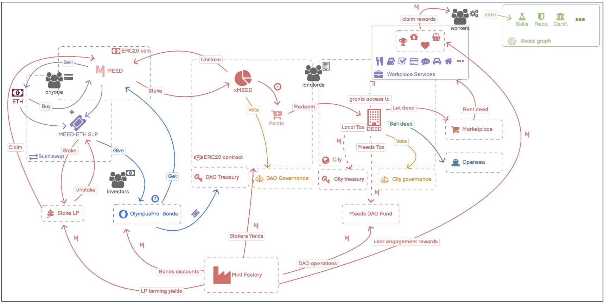
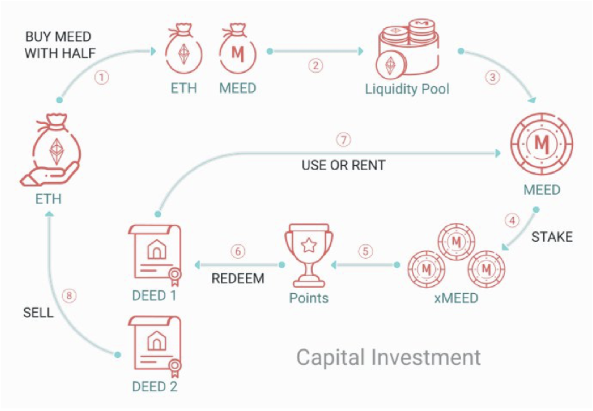

# 5. The Work Metaverse for ALL – vision summary and milestones #

## 5.1. Ultimate goal - decentralized web for everyone ##

In the end, the WoM is a decentralized web world for everyone – every person and every organization.

It will be populated by users, acting through their digital identities **Xeeds** and accessing the world through their metamasks, for crypto-savvies, or login/password for the newbies.
People would allocate their engagement and get rewarded in a fair, transparent and decentralized way. They would get access to the decentralized world and the cryptoworld of tomorrow in an easy and familiar way - they would get simple tools to use their tokens in their lives or invest them for their future.

Organizations - **Deeds** would be able to source talents, browsing through the WoM, for the right proven skills. They would get rewarded for their participation in the metaverse, by minting tokens through their users engagement (mintium model). But most of all, they would benefit from a higher engagement and loyalty from their users.

The WoM would have its own currency **Meeds** – that would be there to spend in stores, convert into another currency, invest for a return on investment, rent or buy etc. The WoM would also facilitate other tokens distribution and participate in the overall crypto ecosystem.

As a picture is worth a thousand words, here is a diagram that describes the WoM and Meeds flows

The world maintenance and sustainability in the long run are ensured through taxes shared between the Meeds association and the Cities.

## 5.2. What’s in it for early adopters ##

Obviously, early adopters would get considerable advantages over the late comers.

In particular, the WoM rewards long-term investment in the verse – that is the redeeming of the property (Deeds). The Deed’s original owner get compensated through engagement minting (active use), through passive income (renting) and get a life-long 1% on any selling transaction of the Deed (at each change of ownership, the original redeemer gets a fee on the transaction).

By believing in the project, participating in the liquidity pools, staking Meeds, redeeming them against Deeds...early investors of all sizes would mint additional tokens. They would also get the earliest voting rights and help shape the metaverse.

Organizations acquiring but especially using Deeds to engage and reward their employees would get compensated in minted Meeds. The fairer they will play, the more they will get. The earlier adopters would be associated to the first historic cities and would be identified as the builders later on.

The diagram below represents an example of the Meeds investment strategy for capital holders :

organizations can of course participate in liquidity pools, but also join the community of builders and get additional engagement rewards there.

The diagram below represents an example of the Meeds investment strategy for work holders :

## 5.3. The launch ##

The official launch date is set as for May 1st, 2022 – the International Workers Day, celebrated in many countries.

At that time, the Meed token already exists. It is possible to acquire it and liquidity pools are open for participation, on Polygon and Ethereum networks.

Three Meeds association members use the system internally to engage and reward their users and improve the Meeds software.

The Investor app is available on Ethereum Mainnet. At launch, it includes staking, liquidity rewards, points accumulation and redeeming of Deeds.

The Builders community is up and running on Meeds software, open to anyone who would want to join, test and participate. It is possible to login with Metamask.

This paper is to be published on the launch day. Following the launch, the token will be air-dropped to many people across the crypto community.

## 5.4. The builders community ##

We are launching the builders community on the Meeds software and on Discord. The community welcomes anyone who wants to take part in the building of the Work
Metaverse. The association would reward builders engagement with Meeds, from its marketing budget.

The association plans also to stake some Meeds in order to acquire (redeem) a Deed for the builders community. The community will then mint Meeds by engagement, through the mintium model, and distribute them to engaged users.

## 5.5. Roadmap and milestones ##

Our roadmap would follow the priority order below:

- Engagement index and minting through engagement
- Enable Deeds renting
- Xeed creation
- Badges improvement and credentials development
- DeFi services – in the wallet, credit cards partnership

We are counting on the early adopters from the DAOs and tech-savvy companies during the building stage. We should also have some early adopters from traditional companies that gain immediate value from the metaverse byproviding relevant engagement programs to their people, on top of their current traditional compensation plans.

Meeds minting spans a 20 year period. By that time, we aspire to have achieved building a mature metaverse, having spread to many organizations and many users globally.

## 5.6. What you can do right now ##

What can you do right now to participate?

- Spread this paper to those who would be interested
- Visit our website https://www.meeds.io/
- Check out the Investor app
- Contribute to the existing liquidity pools here :
  - Cometh Swap
  - Sushi Swap
- Join our discord community to be kept in the loop
- Join our Builders community to test the Meeds software, engage and earn some Meeds engagement rewards

**\*\*\* The Work Metaverse - let’s build this crazy future world together. \*\*\***